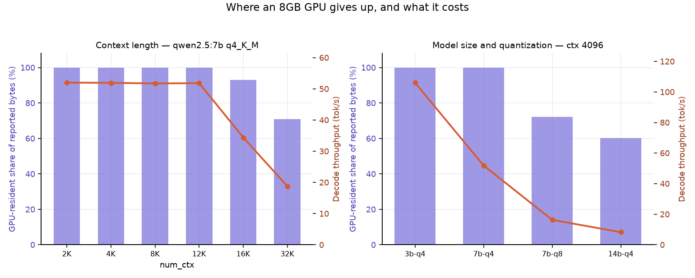
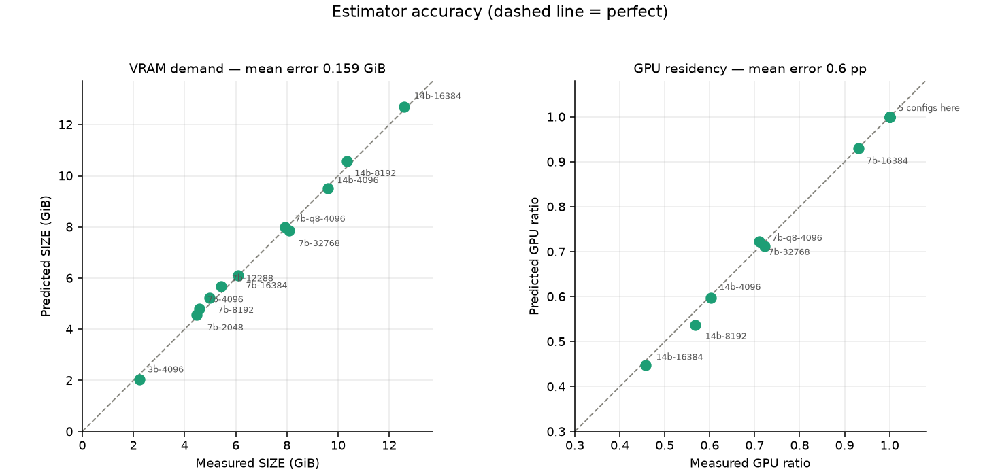

# llm-quant-bench

[English](README.md) · [中文](README.zh-CN.md)


**How large a model can an 8GB consumer GPU actually run?**

A reproducible benchmark of model size × quantization × context length on one
RTX 4060 Laptop (8188 MiB), served by Ollama. Every number is measured on that
machine, and every number was predicted first — the gap between the two is
the point of the project.

---

## The four findings

**1 · Offloading costs more than being a bigger model.**
Qwen2.5-14B at q4_K_M is **6.28× slower** than 7B at the same quantization and
context (8.27 vs 51.94 tok/s). That factor splits cleanly: **1.94×** for being
twice the size, **3.23×** for having 39.7% of it pushed to system RAM. On a
card that can't hold it, the offload penalty exceeds the size penalty.

**2 · The context cliff is sharply non-linear.**
Going from ctx 8192 to 16384 moves **6.8%** of the model's bytes off the GPU
and costs **33.5%** of throughput — a 4.9× amplification. "93% still resident"
sounds like a rounding error and is a 1.5× slowdown. Below the cliff, context
is free: 2K through 12K all run at 51.8 ± 0.2 tok/s.

**3 · `OLLAMA_NUM_PARALLEL` is a hidden 4× multiplier.**
Unset, Ollama picks 1 or 4 slots depending on free VRAM. Because `num_ctx` and
`num_parallel` enter the KV-cache formula as a product, ctx 8192 × 4 slots and
ctx 32768 × 1 slot were measured to consume **identical memory, to the byte**,
twice over. The same config can silently need 4× the VRAM between runs.

**4 · Quantization to q4_K_M costs nothing measurable.**
q8_0 scores 81/100, q4_K_M scores 80. Paired per-item, they **agree on 97 of
100** and the three discordant pairs split 1–2: exact McNemar **p = 1.000**.
Both fail the same 18 items, so q4 introduces no new failure mode. It saves
3.33 GiB — about 27,000 tokens of context — and stays fully resident where q8
is already 34% offloaded.



---

## The VRAM model

Three terms. Only the first is textbook.

```
SIZE ≈ weights + KV_cache + extra
```

**Weights.** Empirical bytes-per-parameter, calibrated against `ollama list`.
q4_K_M measures 0.614 B/param, not the nominal 0.5 — GGUF keeps embeddings and
some attention tensors above the nominal level.

**KV cache.** The only textbook term:

```
KV_bytes = 2 × layers × kv_heads × head_dim × num_ctx × num_parallel × bytes
```

The leading 2 is K and V. Grouped-query attention is what makes any of this
fit: Qwen2.5-7B has 28 attention heads but 4 KV heads, a 7× saving. Without
it, a 32K context would need ~12 GiB of cache alone.

**Extra — mechanism unknown.** Measured context cost on the 7B is 128.0
KiB/token against a theoretical KV of 56.0. See
[what we got wrong](#what-we-got-wrong) below; the honest answer is that we
narrowed it down and did not solve it.

### Accuracy

Across 11 configurations spanning three model sizes, two quantizations and six
context lengths: **mean absolute SIZE error 0.159 GiB, mean absolute
GPU-residency error 0.6 percentage points.** Five of those configurations were
never used for calibration and all land within 0.26 GiB.



The sharpest test: `ctx 12288` was added purely to bracket the cliff. The
estimator put it 0.01 GiB inside the budget — it stayed 100% resident, and
16384 did not.

Full table: [`results/summary.md`](results/summary.md).

---

## What we got wrong

Three systematic errors and one falsified hypothesis. This section exists
because the corrections are more informative than the final numbers.

### 1 · The VRAM budget was a guess

Version 1 assumed Ollama could use 92% of the card — a 7.36 GiB budget. Exact
`size_vram` readings across offloaded configurations cluster at **5.63–5.87
GiB**. Ollama leaves roughly 1.1 GiB untouched beyond the desktop baseline.
The guess was 30% too generous, which is why v1 predicted ctx 16384 would stay
fully resident when it does not.

### 2 · The units were wrong

`ollama ps` and `ollama list` report **decimal GB** (bytes / 10⁹), not GiB.
Comparing GiB predictions against that column carried a silent 7.4% error
through three days of work. Reading exact bytes from `/api/ps` exposed it, and
the refit produced a context slope of **exactly 128.0 KiB per effective
token** with a 4.084 GiB intercept — the P=4 point falls on that line to three
decimals.

### 3 · A whole memory term was missing

Measured context cost is 2.286× the theoretical KV cache. v1 had only the KV
term and under-predicted ctx 32768 by 1.5 GiB.

### 4 · The explanation for that term was falsified — twice

**First hypothesis**: the excess is llama.cpp's materialized attention-score
buffer, present only when flash attention is off. Testable, so it was tested:
`OLLAMA_FLASH_ATTENTION` set from 0 to 1, everything else held constant, ctx
16384 re-measured. SIZE did not move — 6.5 GB and a 12%/88% split under both
settings. Most likely Ollama 0.24 ignores the variable entirely.

**Second hypothesis**: the excess is a fixed multiple of the KV cache. A 14B
context sweep discriminates, because 14B has a different H / H_kv ratio. It
predicted 247 KiB/token for the 14B against a **measured 92**. Refuted. It had
only ever looked right because it was calibrated on the 7B.

**What survives**: the term scales with attention-head count H rather than
KV-head count H_kv — the measured 14B/7B ratio is 1.28 against 1.43 predicted
by that shape and 3.43 by the KV-multiple shape. The magnitude runs ~15% low.

**What neither hypothesis predicted**: the extra term is *exactly zero* at
small contexts. The 14B's marginal cost from ctx 4096 to 8192 is 192.0
KiB/token against a theoretical KV of 192.0. So the excess is not a per-token
buffer at all — it has a threshold. The next experiment is a `num_batch`
sweep, since `n_batch` appears only in the surviving candidate.

The estimator keeps the term as `extra_context_gb`, with the docstring stating
plainly that the mechanism is unknown.

### After all corrections

| | v1 | v3 |
|---|---|---|
| Mean SIZE error | ~1.5 GiB | **0.159 GiB** |
| Mean GPU-residency error | — | **0.6 pp** |

---

## Accuracy evaluation

100 hand-verified items across arithmetic, factual, reasoning, code and
Chinese, graded deterministically — no LLM judge, because a judge running on
the same 8 GB card would contribute its own error.

| Model | Quant | arith | chinese | code | factual | reasoning | Total |
|---|---|---|---|---|---|---|---|
| Qwen2.5-7B | q8_0 | 17/20 | 18/20 | 13/20 | 18/20 | 15/20 | **81** |
| Qwen2.5-7B | q4_K_M | 17/20 | 18/20 | 12/20 | 18/20 | 15/20 | **80** |
| Qwen2.5-14B | q4_K_M | 18/20 | 18/20 | 15/20 | 18/20 | 16/20 | **85** |

The eval set itself needed two corrections before the scores meant anything.
The generated draft put the correct answer on B 62% of the time — a model that
always answered B would have scored 58. And the first baseline run's failures
included short-answer items where the model gave the right number with a unit
attached. Fixing the questions rather than loosening the grader took the
baseline from 77 to 81. Details in
[`results/day5_eval.md`](results/day5_eval.md).

The 14B's five extra points come entirely from code, arithmetic and
reasoning — knowledge and language gained nothing — and cost 6.28× the speed.

---

## Quick start

```bash
git clone https://github.com/jiadewoer/llm-quant-bench.git
cd llm-quant-bench
uv venv
.venv/Scripts/activate.bat      # Windows; use source .venv/bin/activate elsewhere
uv pip install -e ".[dev]"

python scripts/check_env.py
pytest -v
lqb estimate --model qwen2.5-7b --ctx 16384
```

On Windows, `dev.bat` does the UTF-8 codepage switch and venv activation in
one step.

### Pin the Ollama runtime first

Results are not reproducible until these are fixed. Set them, quit Ollama from
the tray, restart it, then open a fresh terminal — neither running shells nor
the running Ollama service reload environment variables.

```
setx OLLAMA_NUM_PARALLEL 1
setx OLLAMA_KEEP_ALIVE 30m
setx OLLAMA_FLASH_ATTENTION 0
setx OLLAMA_KV_CACHE_TYPE f16
```

`check_env.py` verifies all four.

### Commands

```bash
lqb estimate --model qwen2.5-14b --ctx 4096   # predict VRAM demand
lqb ps                                        # what's loaded, exact bytes
lqb bench --model qwen2.5:7b --ctx 8192       # throughput and TTFT
lqb matrix                                    # the whole matrix
lqb eval --model qwen2.5:7b                   # accuracy
lqb review results/eval_<label>.json          # every failure with the reply
lqb report                                    # charts and the comparison table
```

---

## Known limitations

- **Offloaded throughput repeats only to ±10%.** Fully resident
  configurations repeat to ±0.3%; offloaded ones varied 7–11% between two
  sessions, because the layer split is decided at load time against whatever
  VRAM is free. Every offloaded number here is a single measurement and should
  be read with that band.
- **`gpu_ratio` is a byte fraction, not a layer fraction.** SIZE includes the
  KV cache and the unexplained term, and neither is a layer. "6.8% offloaded"
  is a proxy for how much spilled.
- **One machine, one GPU.** Nothing generalises to a desktop 4060 Ti 16GB or
  Apple unified memory without re-measurement.
- **The P=4 ctx32768 row supports no quantitative claim.** It reports 9.014
  GiB resident on a 7.996 GiB card — the Windows driver is presenting host RAM
  as VRAM. It stands only as qualitative evidence of overcommit, and is
  excluded from every statistic here.
- **100 eval items** gives a ±7.7 pp unpaired interval. The paired design goes
  further, but detecting any accuracy difference at p < 0.05 would need about
  eight discordant pairs and q8 vs q4 produced three.
- **Weight estimates underestimate models below ~2B**, where vocabulary
  embeddings dominate. The 3B row is off by 0.19 GiB for this reason.
- **`extra_context_gb` has no established mechanism.**

---

## Hardware and reproduction

| | |
|---|---|
| GPU | RTX 4060 Laptop, 8188 MiB (7.996 GiB), driver 580.88 |
| RAM | 32 GB |
| OS | Windows 11 (26100) |
| Runtime | Ollama 0.24.0 |
| Python | 3.11.9 |

The full matrix ran in one session with the browser closed, on mains power,
Windows power mode set to best performance. Desktop VRAM baseline stayed
between 1.116 and 1.222 GiB across all rows and is recorded per run.

Day-by-day measurement logs, including the failed hypotheses:
[`results/day3_offload.md`](results/day3_offload.md) ·
[`results/day4_perf.md`](results/day4_perf.md) ·
[`results/day5_eval.md`](results/day5_eval.md) ·
[`results/day6_matrix.md`](results/day6_matrix.md)

## License

MIT
